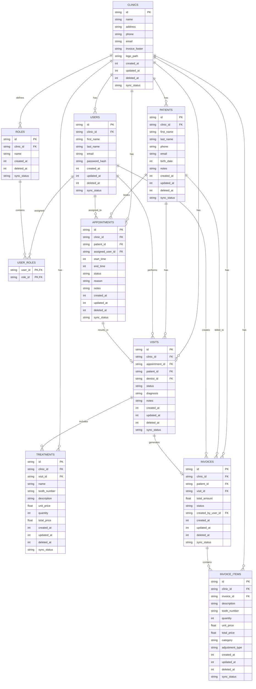

```mermaid
erDiagram

    CLINICS {
        string id PK
        string name
        string address
        string phone
        string email
        string invoice_footer
        string logo_path
        int created_at
        int updated_at
        int deleted_at
        string sync_status
    }

    USERS {
        string id PK
        string clinic_id FK
        string first_name
        string last_name
        string email
        string password_hash
        int created_at
        int updated_at
        int deleted_at
        string sync_status
    }

    ROLES {
        string id PK
        string clinic_id FK
        string name
        int created_at
        int deleted_at
        string sync_status
    }

    USER_ROLES {
        string user_id PK,FK
        string role_id PK,FK
    }

    PATIENTS {
        string id PK
        string clinic_id FK
        string first_name
        string last_name
        string phone
        string email
        int birth_date
        string notes
        int created_at
        int updated_at
        int deleted_at
        string sync_status
    }

    APPOINTMENTS {
        string id PK
        string clinic_id FK
        string patient_id FK
        string assigned_user_id FK
        int start_time
        int end_time
        string status
        string reason
        string notes
        int created_at
        int updated_at
        int deleted_at
        string sync_status
    }

    VISITS {
        string id PK
        string clinic_id FK
        string appointment_id FK
        string patient_id FK
        string dentist_id FK
        string status
        string diagnosis
        string notes
        int created_at
        int updated_at
        int deleted_at
        string sync_status
    }

    TREATMENTS {
        string id PK
        string clinic_id FK
        string visit_id FK
        string name
        string tooth_number
        string description
        float unit_price
        int quantity
        float total_price
        int created_at
        int updated_at
        int deleted_at
        string sync_status
    }

    INVOICES {
        string id PK
        string clinic_id FK
        string patient_id FK
        string visit_id FK
        float total_amount
        string status
        string created_by_user_id FK
        int created_at
        int updated_at
        int deleted_at
        string sync_status
    }

    INVOICE_ITEMS {
        string id PK
        string clinic_id FK
        string invoice_id FK
        string description
        string tooth_number
        int quantity
        float unit_price
        float total_price
        string category
        string adjustment_type
        int created_at
        int updated_at
        int deleted_at
        string sync_status
    }

    %% RELATIONSHIPS

    CLINICS ||--o{ USERS : has
    CLINICS ||--o{ ROLES : defines
    USERS ||--o{ USER_ROLES : assigned
    ROLES ||--o{ USER_ROLES : contains

    CLINICS ||--o{ PATIENTS : has
    CLINICS ||--o{ APPOINTMENTS : has
    CLINICS ||--o{ VISITS : has
    CLINICS ||--o{ TREATMENTS : has
    CLINICS ||--o{ INVOICES : has
    CLINICS ||--o{ INVOICE_ITEMS : has

    PATIENTS ||--o{ APPOINTMENTS : books
    PATIENTS ||--o{ VISITS : has
    PATIENTS ||--o{ INVOICES : billed_to

    USERS ||--o{ APPOINTMENTS : assigned_to
    USERS ||--o{ VISITS : performs
    USERS ||--o{ INVOICES : creates

    APPOINTMENTS ||--o| VISITS : results_in
    VISITS ||--o{ TREATMENTS : includes
    VISITS ||--o| INVOICES : generates

    INVOICES ||--o{ INVOICE_ITEMS : contains
```